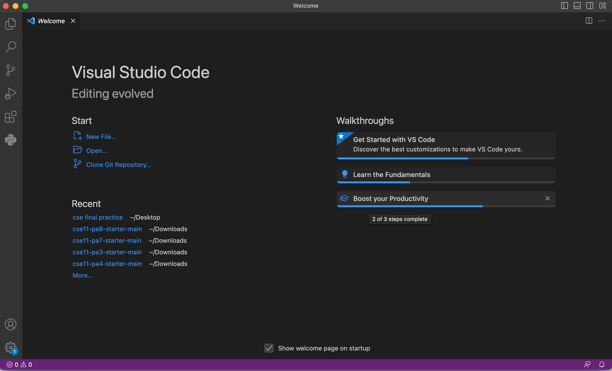
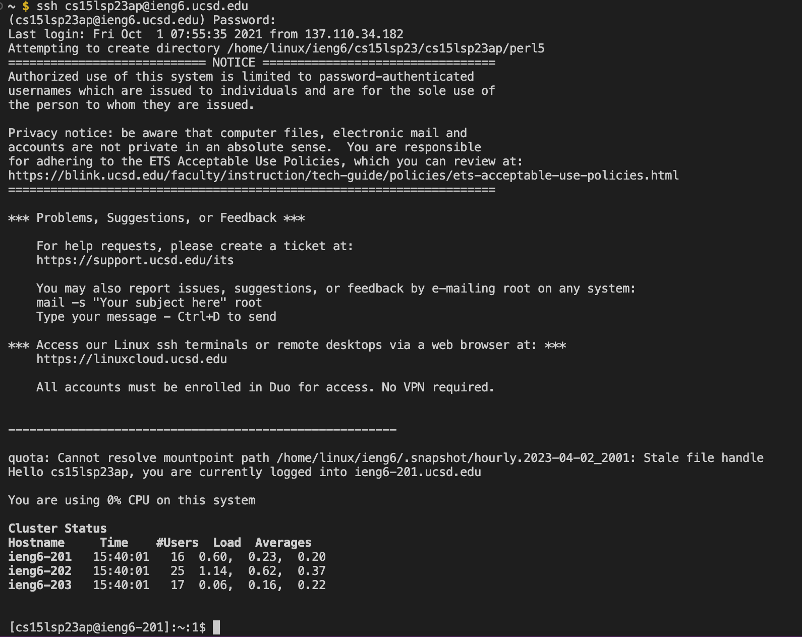

# Tutorial - Remote Access
---
**This is a tutorial for logging into your course specific account on ieng6**

## Installing Visual Studio Code
Go to the Visual Studio Code website [link](https://code.visualstudio.com/) and 
follow the instructions to download and install it on your computer. There are
versions for all the major operating systems, like macOS (for Macs) and Windows (for PCs).

When it is installed, you should be able to open a window that looks 
like this (it might have different colors, or a different menu bar, depending on your system and settings):

## Remotely connecting
Many courses in CSE use course-specific accounts. These are similar to accounts you might
get on other systems at other institutions (or a future job). We’ll see how to use VScode/terminal
to connect to a remote computer over the Internet to do work there.

There is a first step you need if you’re on Windows: install git for Windows, which comes with some useful tools we need:
[git for windows](https://gitforwindows.org/)

Once installed, use the steps in this post to set your default terminal to use the newly-installed git bash in Visual Studio Code:
[Using bash on vscode](https://stackoverflow.com/questions/42606837/how-do-i-use-bash-on-windows-from-the-visual-studio-code-integrated-terminal/50527994#50527994)

Then, to use ssh, open a terminal in VScode. Use the Terminal → New Terminal menu option. Your command will look like this, but with the zz replaced by the letters in your course-specific account.
`$ ssh cs15lsp23zz@ieng6.ucsd.edu`

Since this is likely the first time you’ve connected to this server, you will probably get a message like this:
`ssh cs15lsp23zz@ieng6.ucsd.edu
The authenticity of host 'ieng6.ucsd.edu (128.54.70.227)' can't be established.
RSA key fingerprint is SHA256:ksruYwhnYH+sySHnHAtLUHngrPEyZTDl/1x99wUQcec.
Are you sure you want to continue connecting (yes/no/[fingerprint])?`

Type `yes` and press enter, then give your password; the whole interaction should look something like this once you give your password and are logged in:
`# On your client
⤇ ssh cs15lsp23zz@ieng6.ucsd.edu
The authenticity of host 'ieng6-202.ucsd.edu (128.54.70.227)' can't be established.
RSA key fingerprint is SHA256:ksruYwhnYH+sySHnHAtLUHngrPEyZTDl/1x99wUQcec.
Are you sure you want to continue connecting (yes/no/[fingerprint])? 
Password: `

Now your terminal is connected to a computer in the CSE basement, and any commands you run will run on that computer! We call your computer the client and the computer in the basement the server based on how you are connected.

If in doubt or if you encounter an error, just ask someone!
