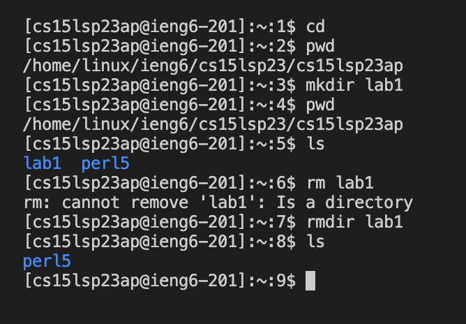

# Lab Report 1
---
**This is a tutorial for logging into your course specific account on ieng6**

## Installing Visual Studio Code
Go to [link](https://code.visualstudio.com/) and 
follow the instructions to download vscode on your computer.

When it is installed, you should be able to open a window that looks 
like this (it might look slightly different. That's ok!):

Note: I didn't have to do this step (of installing vscode) as I already had it installed on my system.

## Remotely connecting
The goal here is to use the vscode terminal
to connect to a remote computer over the Internet and then do work there.

If you’re on Windows: install git from the site:
[git for windows](https://gitforwindows.org/)

After that, use the steps in the following link to use git bash in vscode:
[bash on vscode](https://stackoverflow.com/questions/42606837/how-do-i-use-bash-on-windows-from-the-visual-studio-code-integrated-terminal/50527994#50527994)

Note: I didn't install/use git (I already had it installed on my system) because I'm on MacOS.

Use the Terminal → New Terminal menu option to open a terminal on vscode where you can use ssh as follows (replace zz with the letters in your own course specific account)

`$ ssh cs15lsp23zz@ieng6.ucsd.edu`

Since this might be the first time you’ve connected to this server, you will probably get a message like this:

`ssh cs15lsp23zz@ieng6.ucsd.edu
The authenticity of host 'ieng6.ucsd.edu (128.54.70.227)' can't be established.
RSA key fingerprint is SHA256:ksruYwhnYH+sySHnHAtLUHngrPEyZTDl/1x99wUQcec.
Are you sure you want to continue connecting (yes/no/[fingerprint])?`

Type `yes` and press enter, then give your password. It should look like this after you are logged in:

`# On your client
⤇ ssh cs15lsp23zz@ieng6.ucsd.edu
The authenticity of host 'ieng6-202.ucsd.edu (128.54.70.227)' can't be established.
RSA key fingerprint is SHA256:ksruYwhnYH+sySHnHAtLUHngrPEyZTDl/1x99wUQcec.
Are you sure you want to continue connecting (yes/no/[fingerprint])? 
Password: `

Now your terminal is connected to a computer in the CSE basement, and your commands will be run on that computer! So your computer can be considered as the client and the computer in the CSE basement as the server.

## Trying some commands
Try running the commands cd, ls, pwd, mkdir, cat and rmdir a few times on your terminal (after ssh-ing)

`cd`

This command is the 'change directory' command. It is used to change the current location of the user into a different directory, i.e. to move through directories. For instance, `cd ..` takes you into the parent directory (one directory above) of the current directory. If lab1 is a directory inside your current directory, then cd lab1 will take you into the lab1 directory. Simply typing cd without any arguments will take you to the home directory (the directory which contains files and folders for a single user)

`ls`

This command is the 'list' command. It lists the contents (the files and directories) of the current directory you are in to the terminal. For example, if your current directory has a file called lab_report.txt and a folder called lab1, then ls will output these to the terminal.

`pwd`

This is the 'print working directory' command. It outputs the entire path (from the root directory) of the current directory to the terminal. For instance, if the current directory called lab1 is in the desktop folder which is in the home directory (of a user called bob), then `pwd` would output `/Users/bob/desktop/lab1` to the terminal

`mkdir new_directory`

This is the 'make directory' command. It creates a new directory inside the current directory. For instance, `mkdir lab1` will create a new directory called lab1 inside the current directory. If we call ls after that command we will see that a new directory called lab1 exists in the contents of the current directory.

`rmdir new_directory`

This is the 'remove directory' command. It removes the specified directory from the current directory. For instance, `rmdir lab1` will remove the lab1 directory (if it exists) from the current directory. If we run `ls` after that, we will see that lab1 has been removed from the current directory's contents

`cat /home/linux/ieng6/cs15lsp23/public/hello.txt`

This is the 'concatenate' command. It outputs the contents of a file to a terminal. It is also used to concatenate the contents of multiple files. For instance, if we have hello.java and bye.txt in our current directory, running `cat hello.java bye.txt` would output the contents of those two files onto the terminal.

To log out of the remote server in your terminal, do:
* Ctrl-D
or
* Run the command exit
You can also open more terminals in VSCode using the + button at the top of the terminal.

If in doubt or if you encounter an error in any of the steps, just ask someone!

You have finished this tutorial. Congratulations!
