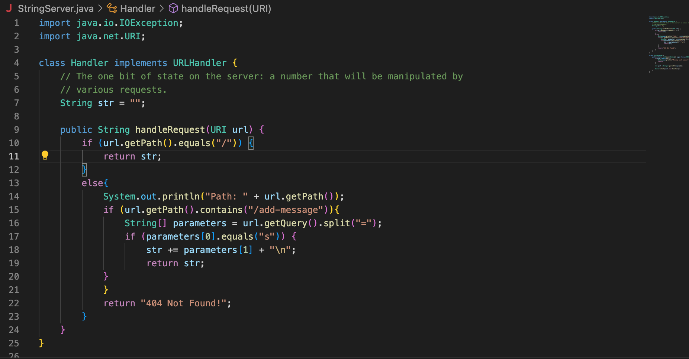
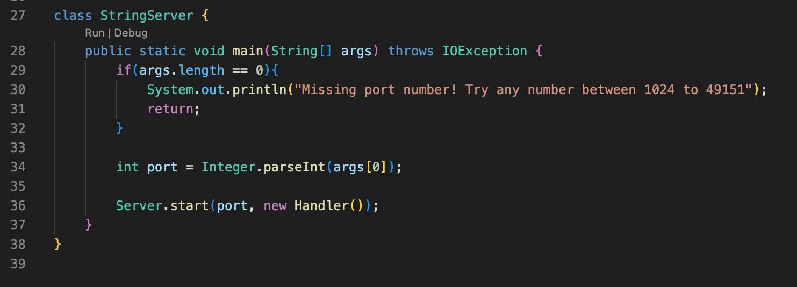
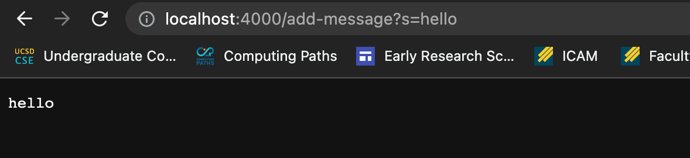
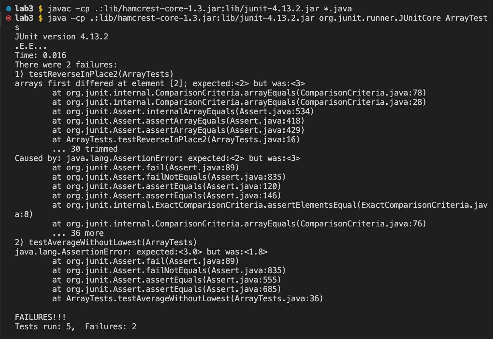

# Lab Report 2

## Part 1 - Running StringServer

Write a web server called StringServer which should keep track of a single string that gets added
to by incoming requests. These requests should look like this:


`/add-message?s=<string>`


The request should concatenate a new line (`\n`)
and the string after `=` to the current string, and then output the entire string so far to the page.


So, after

`/add-message?s=hello`


The page should show

`hello`

And after

`/add-message?s=How are you`

The page should show 

```
Hello
How are you
```

The code for my implementation of StringServer is below:




Note: StringServer.java was made in the same folder as Server.java which gives us the URLHandler interface and helps start the server on which our 
website runs.

Here, when you run StringServer with the port value 4000, the main method is run first. 
Since length of args is not 0, the value of port is set to 4000 and the server is started using the Server.start()
method which takes the port and a new Handler() object as input. 


Now, when you run the server with `/add-message?s=hello`, the page shows:




1) First, the entire url is taken as input as new URI("http://localhost:4000/add-message?s=hello") by the handleRequest() method in the Handler() class and the value of the local variable str is an empty string.

2) The if condition uses the getPath() and equals() function to check if the path is the root directory or /.

3) Since it isn't, the else condition is evaluated

4) This prints the current path to the terminal using the println method, then the if condition inside checks if the path contains "/add-message" using
the getPath and contains method. 

5) Since it does contain "/add-message", the body of the if condition is run where the parameters variable is set
equal to {"s", "hello"} since the getQuery method returns the query string s=hello from the url and when that is split at the "=", we get parameters.

6) Now, since parameters[0] does indeed equal s, the if condition inside the current if condition is also evaluated. The value of the local variable
str is updated to become "hello\n" and returned


After that, when you run `/add-message?s=How are you`, the page shows:


a) The initial part of the handleRequest method runs similarly as in 1) to 4) above.

b) Next, since the path does contain "/add-message", the body of the if condition is run where the parameters variable is set
equal to {"s", "how are you"}.

c) Now, since parameters[0] does indeed equal s, the if condition inside the current if condition is also evaluated. The value of the local variable
str is updated to become "hello\nhow are you\n" and returned. This is why we see hello on one line and how are you on one line in 
output on the page


## Part 2 - Tests and bugs
I have chosen the bug in ArrayExamples.java in the reverseInPlace method


**Failure inducing input**

```
@Test 
public void testReverseInPlace2() {
    int[] input1 = {1, 2, 3, 4};
    ArrayExamples.reverseInPlace(input1);
    assertArrayEquals(new int[]{4, 3, 2, 1}, input1);
}
```

**Input that doesn't induce failure**

```
@Test 
public void testReverseInPlace() {
	int[] input1 = { 3 };
	ArrayExamples.reverseInPlace(input1);
	assertArrayEquals(new int[]{ 3 }, input1);
}
```

**Symptom (as output of above tests)**




The failure of testReverseInPlace2 is because the test expected 2 at index 2 of input1 but found 3.

**The before and after code**

Before:

```
static void reverseInPlace(int[] arr) {
    for(int i = 0; i < arr.length; i += 1) {
      arr[i] = arr[arr.length - i - 1];
    }
  }
```

After (The code fix):

```
static void reverseInPlace(int[] arr) {
    for(int i = 0; i < arr.length / 2; i += 1) {
      int temp = arr[i];
      arr[i] = arr[arr.length - i - 1];
      arr[arr.length - i - 1] = temp;
    }
  }
  ```
  
 Earlier, the bug was that the for loop looped through the entire array instead of half the array. As a result,
 the elements in the second half would correctly be placed at indices in the first half. However, since they now replace
 the elements in the first half, the for loop sets the elements in the second half to remain the same.
 So, with the input as {1, 2, 3, 4}, the output becomes {4, 3, 3, 4}.
 
 The new code fixes this by only looping through half the code. Here, the elements in the second half
 are correctly placed at indices in the first half. Since each element in the first half is stored in temp, 
 it is not forgotten and each corresponding element in the second half gets replaced by the value of temp at the particualar index correctly.
 

## Part 3 - What I've learnt
 
Something I learnt in week 2 is how to run servers from my own computer and from other computers I have remotely connected to. It was 
also interesting to understand different parts of a url and how I can vary the output of the web page depending on the query or the path.
 

