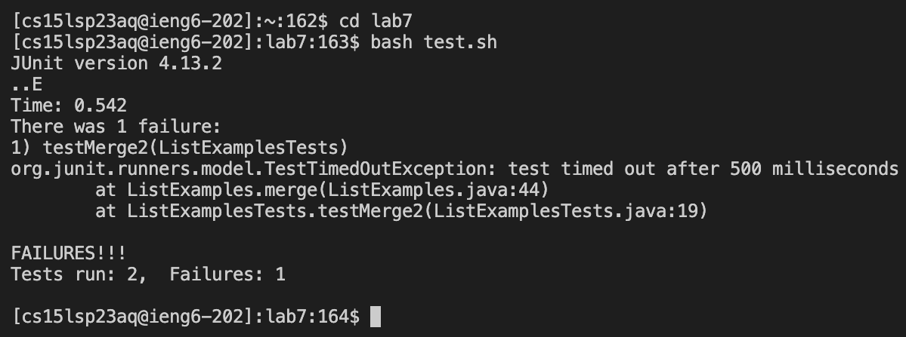

# Lab Report 4

In this lab report, I will be showing how I edited a file and commited the changes 
to github only using the command line. The keystrokes for the same will be shown.

Before you do any of the following steps, make sure you've deleted any existing forks you
have of the lab7 repository and then fork it to your github account.

## 1 - Logging into ieng6
Keystrokes used: 
* ```ssh cs15lsp23aq@ieng6.ucsd.edu <enter> ```
* ```My password here <enter>```
  

  
## 2 - Clone the fork you made of lab7 from your github account
Keystrokes used: 
* ```git clone https://github.com/a2kohli/lab7.git <enter> ```(clones the repository)
* ```cd lab7 <enter>``` (changes directory to lab7)

  
  
## 3 - Run the tests, demonstrating that they fail
Keystrokes used: 
* ```bash test.sh``` (runs the tests)
  
  
  
## 4 - Edit the code file to fix the failing test
Keystrokes used: 
* ```vim ListExamples.java```
* ```/index1``` (this found the first occurence of index1)
* ```nnnnnnnnn``` (this navigated to the desired occurence of index1
* ```<right><right><right><right><right><right>``` (this navigated to the end of the occurence of index1)
* ```i``` (this entered insert mode)
* ```<delete>``` (this removed 1 from index1)
* ```2``` (this replaced the 1 that was deleted with 2 to make it index2)
* ```<esc>``` (this goes to normal mode)
* ```:wq``` (this saves the changes to the file and moves out of vim)
         

  

  
## 5 - Run the tests, demonstrating that they now succeed
Keystrokes used: 
* ```bash test.sh``` (runs the tests)
  

                     
## 6 - Commit and push the resulting change to your Github account
Keystrokes used: 
* ```git add ListExamples.java``` (adds the ListExamples.java file)
* ```git commit -m "ListExamples commited"``` (commits the file)
* ```git push git@github.com:a2kohli/lab7.git``` (pushes the changed file to the github account)
  


                   
