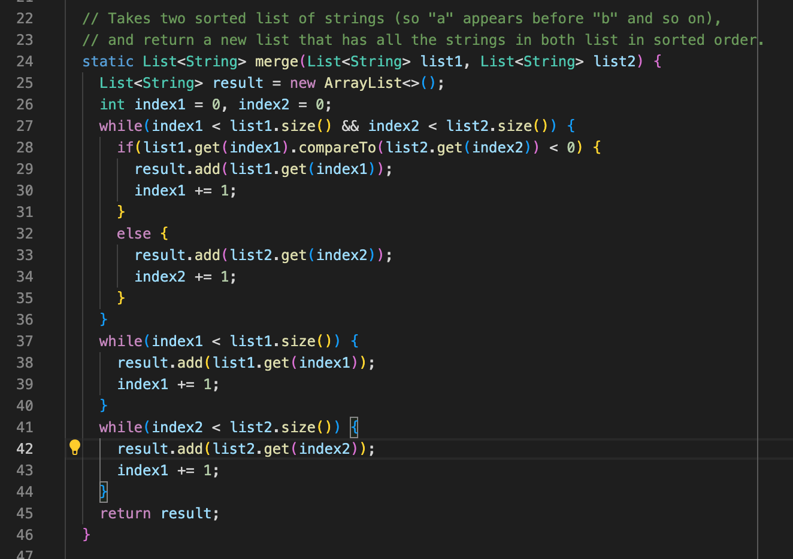
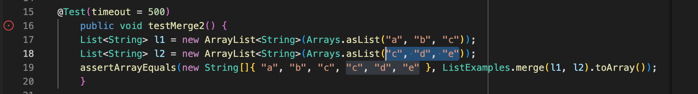
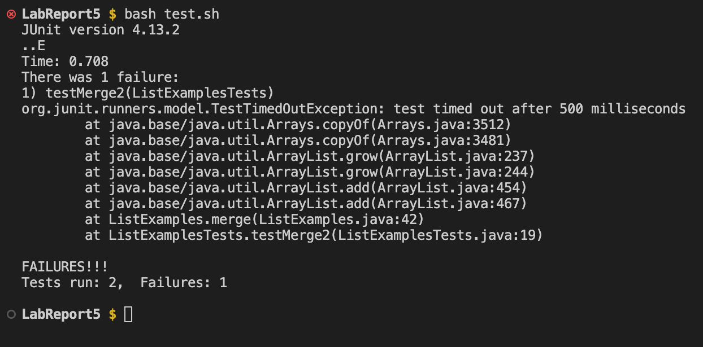
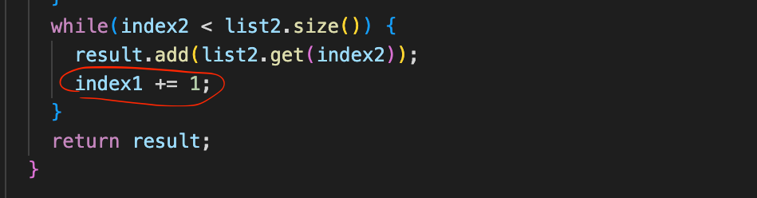
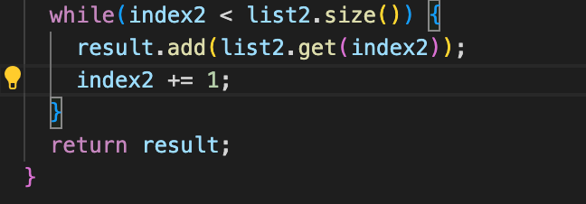
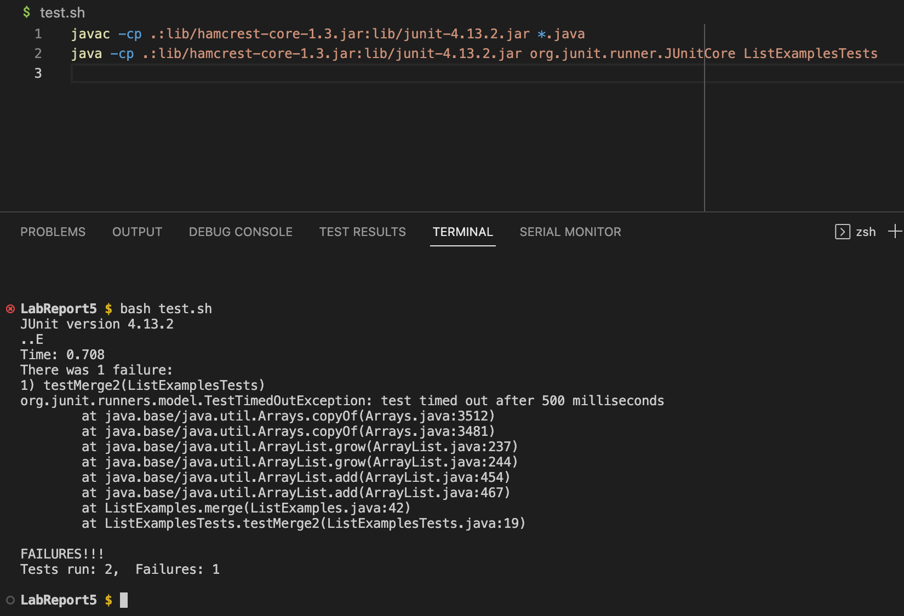
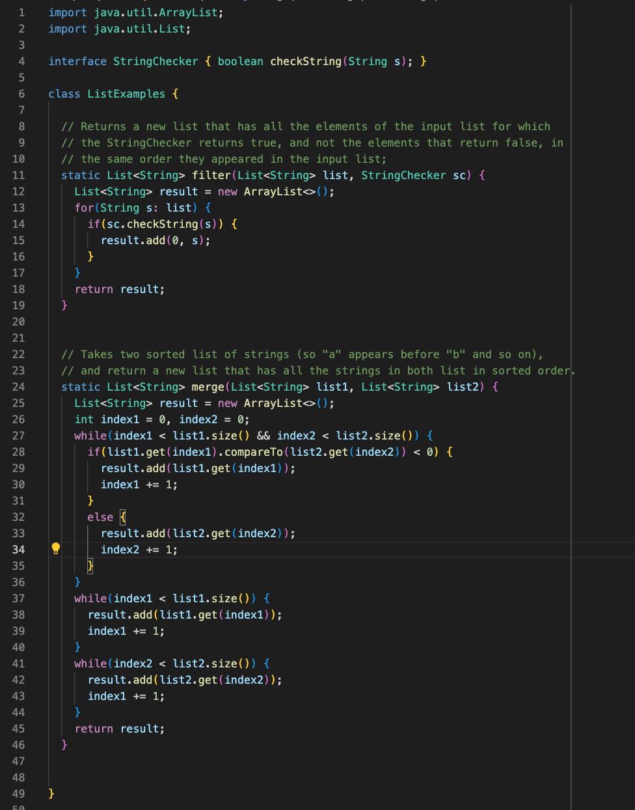
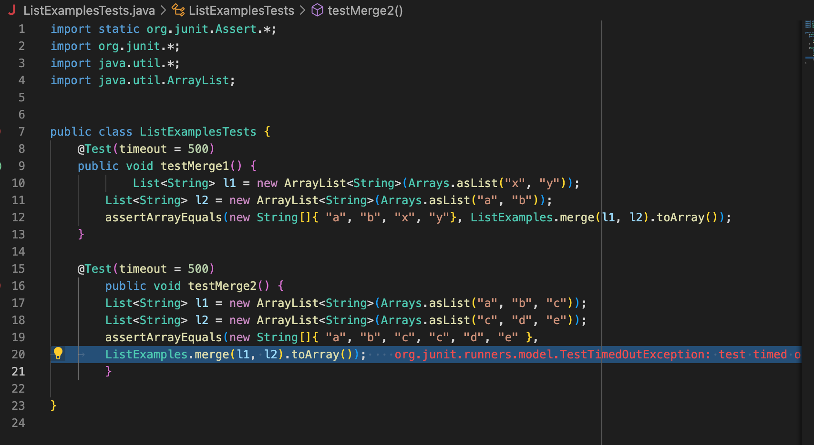
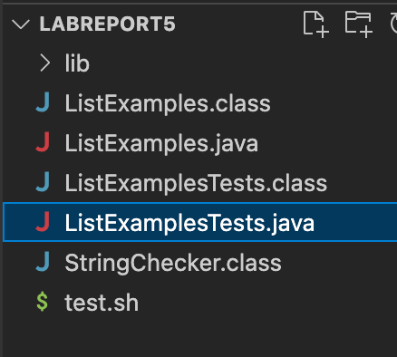

# Lab Report 5


In this Lab Report, we act as the TAs and help a student debug their code.


## Part 1 - Debugging Scenario


### 1. Student debugging post on EdStem:


**Q - What environment are you using (computer, operating system, web browser, terminal/editor, and so on)?**


A - Macbook, MacOS, VS Code


**Q - Detail the symptom you're seeing. Be specific; include both what you're seeing and what you expected to see instead. 
Screenshots are great, copy-pasted terminal output is also great. Avoid saying “it doesn't work”.**


A - I am failing testMerge2() in ListExamplesTests from week 7 lab. I ran the tests by running the bash script test.sh
and the output showed that the test timed out. However, the value I expected (as can be seen in the assertEquals) was the
merged array { "a", "b", "c", "c", "d", "e" } when running ```ListExamples.merge(l1, l2).toArray()```. I don't understand why 
the test is timing out instead of showing the expected output. 


The screenshots for the ListExamples code (which has the error(s) causing the test to fail), the tests in ListExamplesTests, and
the output of running test.sh in the terminal have been added below


The merge method in ListExamples:



The testMerge2() test which fails:


Output of running test.sh:


**Q - Detail the failure-inducing input and context. That might mean any or all of the command you're running, a test case, 
command-line arguments, working directory, even the last few commands you ran. Do your best to provide as much context as you can.**

A - The failure inducing input is ```ListExamples.merge(l1, l2).toArray()``` where l1 is the list ["a", "b", "c"] and l2
is the list ["c", "d", "e"]. The merge method in ListExamples should merge the two sorted lists and return a new List (which is 
then made into an array) such that the new list is also sorted.


### 2. The TA's reply

test.sh and ListExamplesTests look fine. Based on the definition of merge, you are correct in terms of the expected output you want to see.
To fix the timeout in your test, you might want to look at your ListExamples.java file and check if there is any loop which might be running for 
too long or running infinitely because a condition is always met.

### 3. Result of student trying TA's suggestion

I looked over my ListExamples.java file and found that I had been updating index1 in a while loop where I should have been updating index2. As a result,
the while loop condition that index2 < list2.size() is always met and the loop never ends. This is shown below.

The problem in my code:


To correct this we can just write ```index2 += 1;``` instead of ```index1 += 1;```

The fix:



### 4. All the information needed about the setup

test.sh and the output when one test fails:


ListExamples.java before the code fix:


ListExamplesTests.java:


File and Directory structure:



The code fix: I wrote ```index2 += 1;``` instead of ```index1 += 1;``` on line 43.


## Part 2 - Reflection
One thing I've learnt in the second half of the course is how to use git and commit changes to files from the command line 
instead of having to use github desktop. This could be highly useful in later projects I do where I use github.


